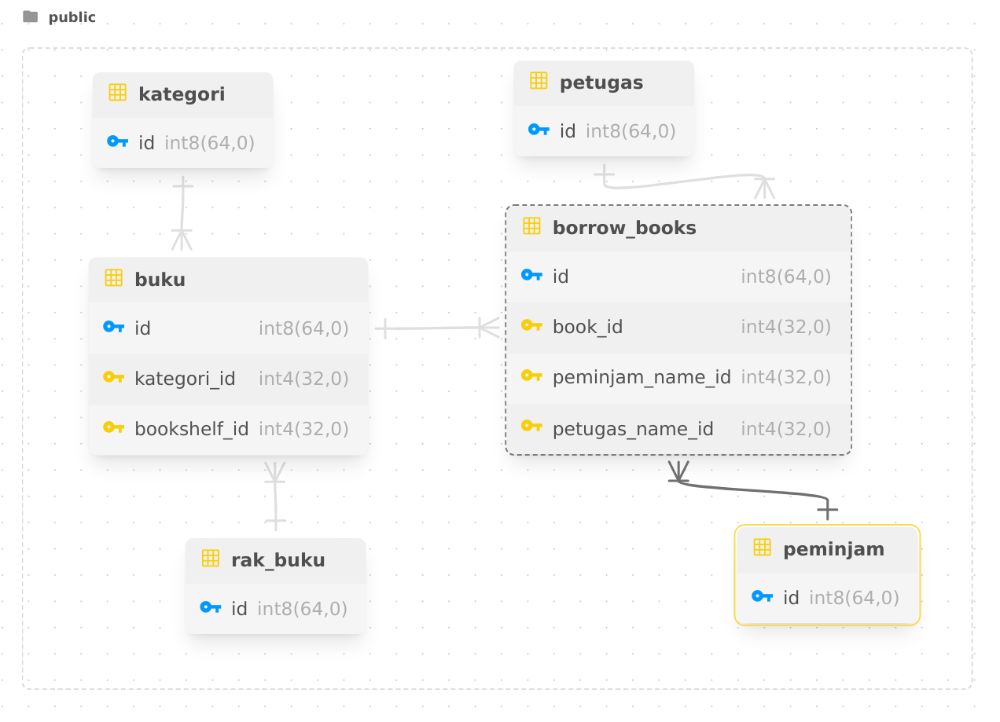
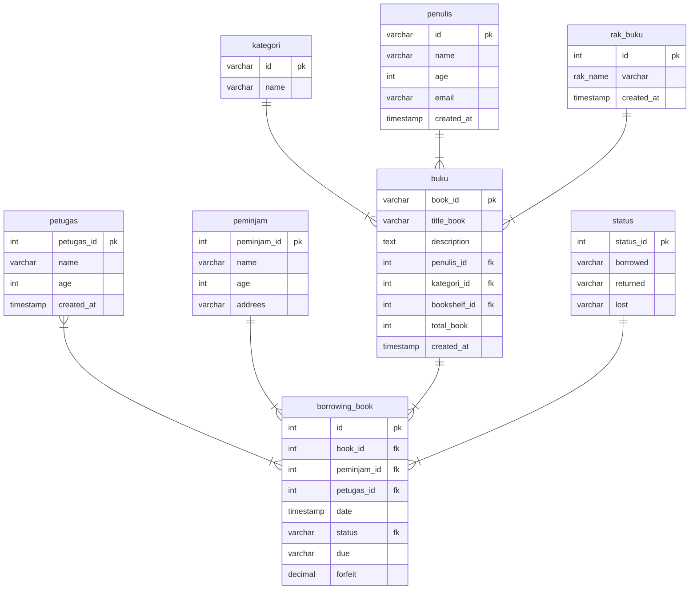

# Minitask

## Screenshot

```mermaid

erDiagram
    kategori ||--|{buku: ""
    petugas }|--|{borrowing_book: ""

    penulis {
        varchar id pk
        varchar name
        int age
        varchar email
        timestamp created_at
    }
    penulis ||--|{buku: ""
    buku {
        varchar book_id pk
        varchar title_book
        text description
        int penulis_id fk
        int kategori_id fk
        int bookshelf_id fk
        int total_book
        timestamp created_at
    }

    kategori {
        varchar id pk
        varchar name
    }

    rak_buku||--|{buku : ""
    rak_buku {
        int id pk
        rak_name varchar
        timestamp created_at
    }
    petugas {
        int petugas_id pk
        varchar name
        int age
        timestamp created_at
    }
    peminjam ||--|{borrowing_book: ""
    peminjam {
        int peminjam_id pk
        varchar name
        int age
        varchar addrees
    }

    buku ||--|{borrowing_book: ""
    borrowing_book {
        int id pk
        int book_id fk
        int peminjam_id fk
        int petugas_id fk
        timestamp date
        varchar status fk
        varchar due
        decimal forfeit
    }
    status ||--|{borrowing_book:""
    status {
        int status_id pk
        varchar borrowed
        varchar returned
        varchar lost
    }

```
