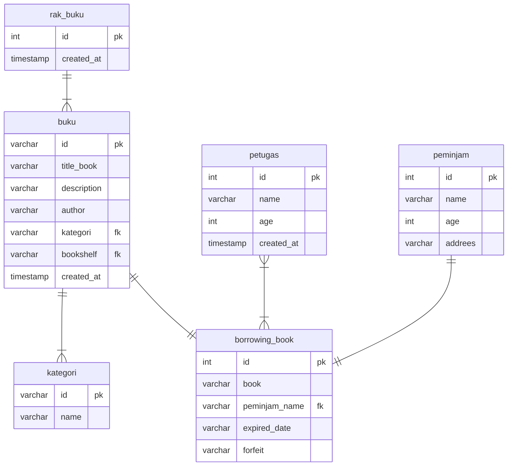

# Minitask

```mermaid

erDiagram
    buku ||--|{kategori: ""
    petugas }|--|{borrowing_book: ""

    buku {
        varchar id pk
        varchar title_book
        varchar description
        varchar author
        varchar kategori fk
        varchar bookshelf fk
        timestamp created_at
    }

    kategori {
        varchar id pk
        varchar name
    }

    rak_buku||--|{buku : ""
    rak_buku {
        int id pk
        timestamp created_at
    }
    petugas {
        int id pk
        varchar name
        int age
        timestamp created_at
    }
    peminjam ||--||borrowing_book: ""
    peminjam {
        int id pk
        varchar name
        int age
        varchar addrees
    }

    buku ||--||borrowing_book: ""
    borrowing_book {
        int id pk
        varchar book
        varchar peminjam_name fk
        varchar expired_date
        varchar forfeit
    }
```
