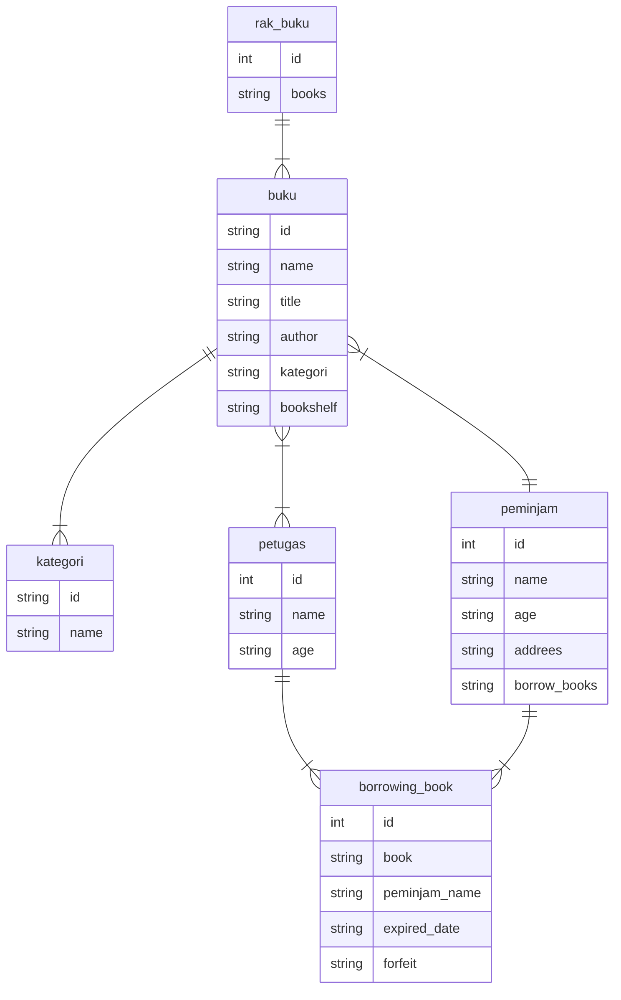

# Minitask

<!--

one to one relationship
BOOK ||--o{ AUTHOR : allows

AUTHOR ||--||buku : has
AUTHOR {
    int id
    string name
    int age
    string books
}

||--|{ : One and only one to One or many
||--o{ : One and only one to Zero or many
|o--|{ : Zero or one to One or many

 -->

