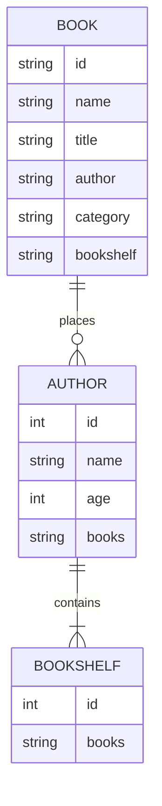

# Minitask

```mermaid

erDiagram
    BOOK ||--o{ AUTHOR : places


    BOOK {
        string id
        string name
        string title
        string author
        string category
        string bookshelf
    }

    AUTHOR ||--|{ BOOKSHELF : contains
    AUTHOR {
        int id
        string name
        int age
        string books
    }


    BOOKSHELF {
        int id
        string books
    }
```
